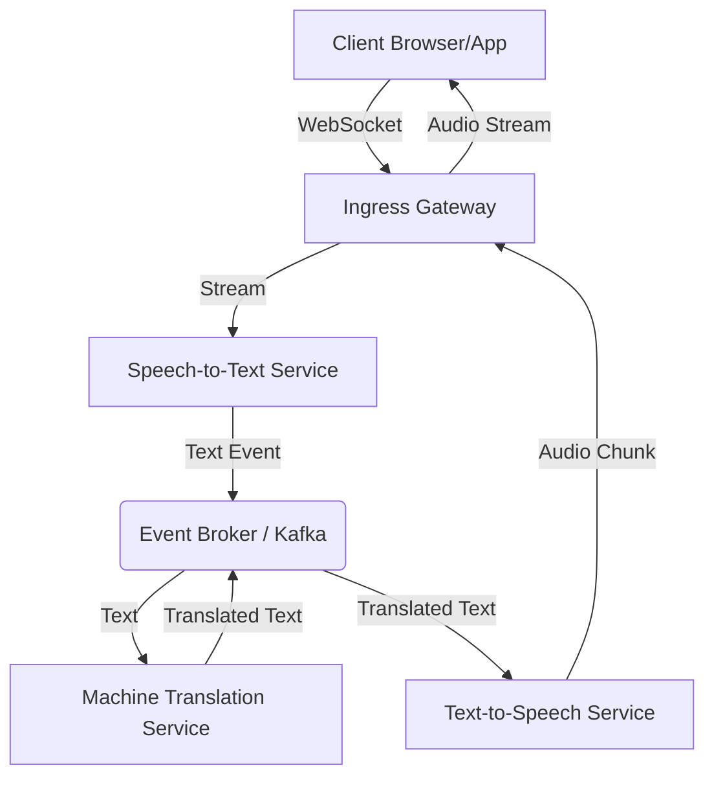

# System Architecture: Real-Time Speech-to-Speech Translation Platform

**Last Updated**: 2026-03-17
**Status**: [ACTIVE] Reconciled from Thesis Narrative Baseline (Epic 1.1)

## 1. Changelog
| Date       | Change                                      | Rationale                                     |
|------------|---------------------------------------------|-----------------------------------------------|
| 2026-03-17 | Plan 004 (Epic 1.4) Architecture Review.    | APPROVED WITH CHANGES: Observability Invariant|
| 2026-03-17 | Plan 003 (Epic 1.3) Architecture Review.    | APPROVED for Analysis and Design Chapter.     |
| 2026-03-17 | Plan 002 (Epic 1.2) Architecture Review.    | APPROVED for Research Framing and Background. |
| 2026-03-16 | Plan Revision 3 Reconciliation (Epic 1.1).  | Align with governance-fix and execution paths. |
| 2026-03-16 | Plan Review Reconciliation (Epic 1.1).      | Align plan with architectural findings.       |
| 2026-03-16 | Initial baseline consolidation from thesis. | Align architecture docs with thesis statement. |

## 2. Purpose
A platform for real-time, event-driven speech-to-speech translation (ASR, MT, TTS) balancing latency, scalability, and robustness as a cost-effective alternative to proprietary cloud APIs.

## 3. High-Level Architecture
The system follows an **Event-Driven Microservices** pattern.

### 3.1 Component Diagram

## 4. Architectural Drivers
- **Latency (P99 < 2s)**: End-to-end speech-in to audio-out.
- **Scalability**: Horizontal scaling of GPU-heavy translation and ASR workers.
- **Robustness**: Handling of component failure (e.g., ASR crash) without session state loss.
- **Evidence Traceability**: Every architectural claim must map to a "Normal-vs-Debug" telemetry baseline.

## 5. Technical Decisions (ADR)
| ID | Decision                   | Rationale                                       | Status   |
|----|----------------------------|-------------------------------------------------|----------|
| 1  | Event-Driven Pipeline      | Decouple heavy AI processing stages for scaling.| Accepted |
| 2  | WebSocket Ingress          | Low-overhead bidirectional audio streaming.    | Accepted |
| 3  | Claim-Check Pattern (S3)   | Handle large audio artifacts in event flow.    | Accepted |
| 4  | Implementation Separation  | Move companion assets to implementation paths. | Accepted |
| 5  | Utility Tree Requirement   | Mandatory QA mapping for all thesis arguments.  | Accepted |
| 6  | Normal-vs-Debug Telemetry  | Enforce privacy-safe shareable evidence.        | Accepted |

## 6. Observability & Implementation Invariants
- **Normal Telemetry (Shareable)**: Metadata only (Correlation IDs, duration_ms, byte counts). No raw content.
- **Debug Telemetry (Restricted)**: Deep trace/log inspection with explicit opt-in.
- **Den Gyldne Rengøringsregel**: All implementation narratives must explicitly link to these invariants to ensure the architectural boundary remains clean and diagnosable.

## 7. Quality Attributes & Problem Areas
- **Clock Drift**: Synchronizing latency measurements across distributed workers.
- **Cold Start**: GPU allocation latency for scaling workers.

---
[[WF-E1.1]]
