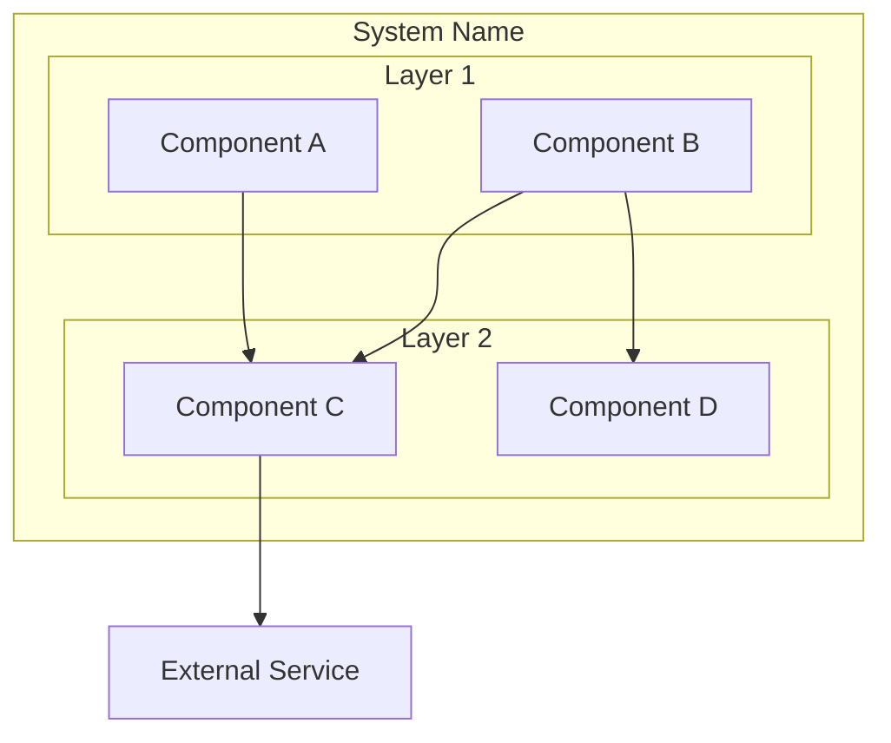
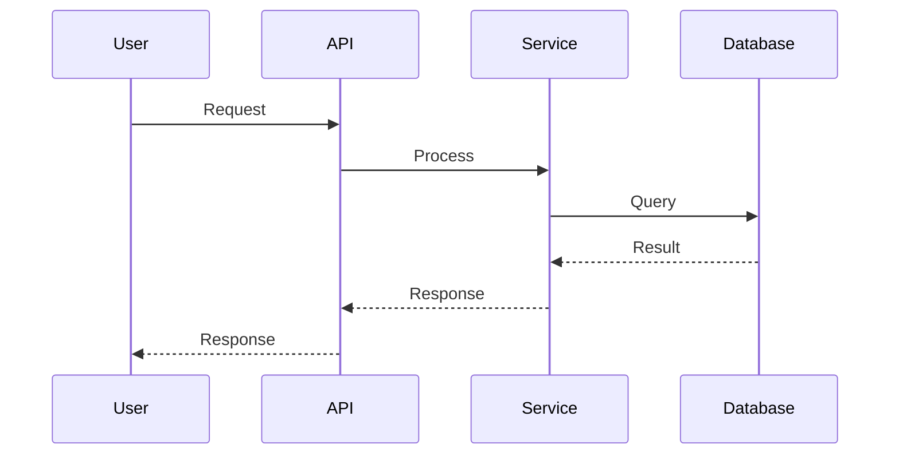
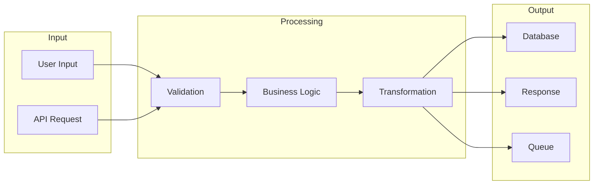
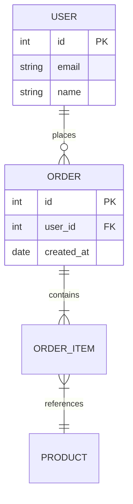
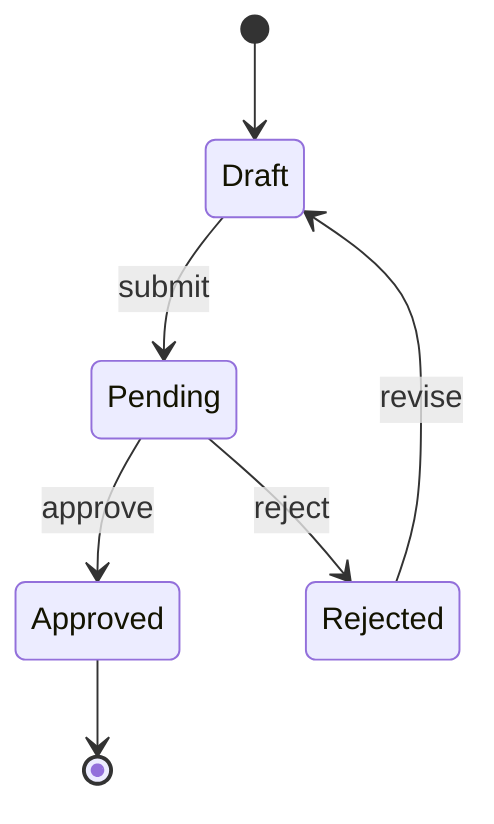
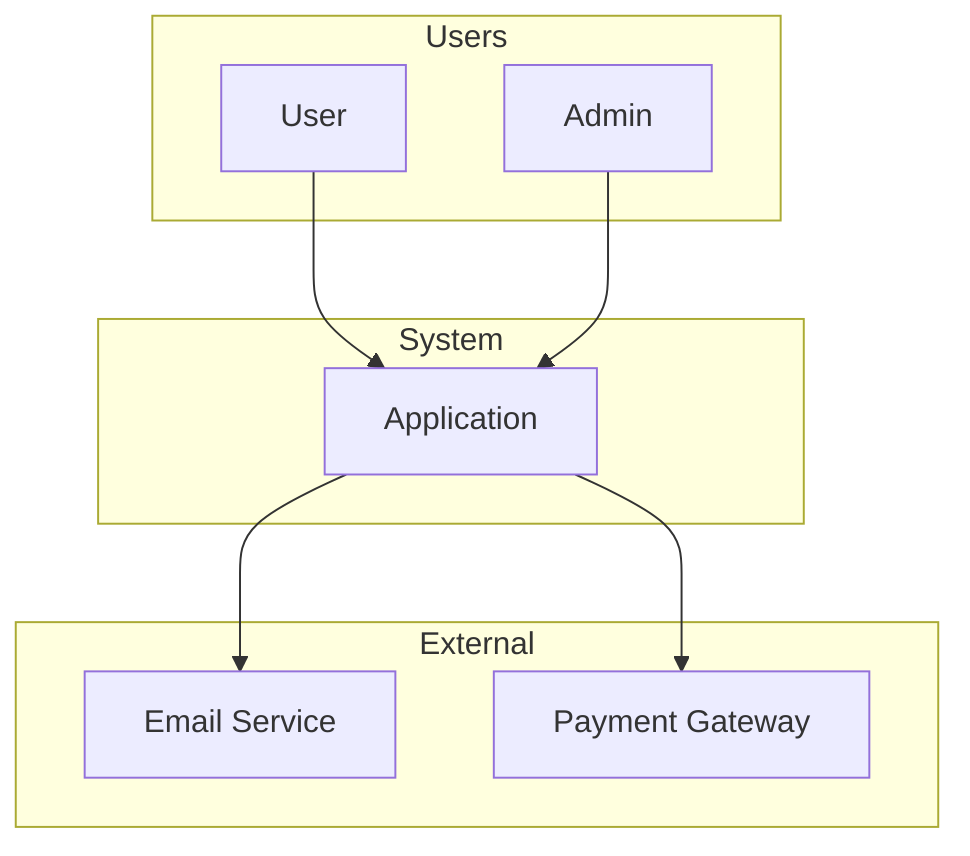
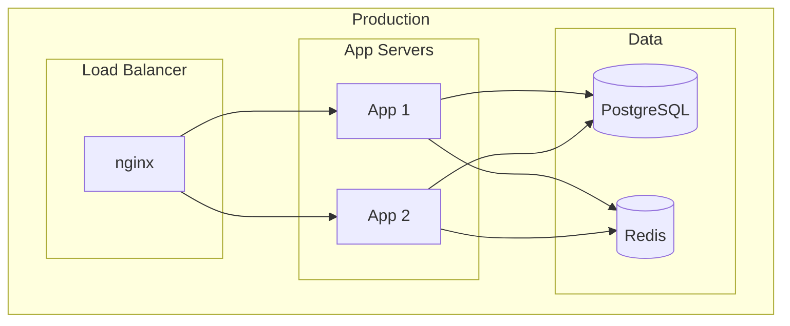

# Architecture Patterns

Reference for architectural design and documentation. Use this skill when:
- Architect reviews system design
- Planner considers architectural constraints
- Analyst investigates integration approaches
- Critic evaluates architectural alignment

## Document & Workflow Sync (Architecture)

Every architectural decision must be reflected across two structural layers:
1. **Execution Artifact (`agent-output/architecture/`)**: The detailed ADRs, master architecture doc, and findings.
2. **Workflow Graph (`workflows/`)**: The lightweight `WF-*` nodes linking architecture decisions to specific Epics and Plans using standard native markdown links.

---

## Architecture Decision Records (ADR)

### ADR Format

Every significant architectural decision should be documented in `agent-output/architecture/`. All ADRs and Findings documents MUST include this standard YAML frontmatter for artifact indexing:

```markdown
---
ID: [NNN]
Type: Architecture
Status: [Proposed | Accepted | Deprecated]  # This is the decision status, not execution status
Epic: "workflows/WF-E<epic-number>.md"
---
# ADR-[NNN]: [Decision Title]

## Context
[What is the situation? What forces are at play?]

## Decision
[What is the change being proposed or decided?]

## Consequences
### Positive
- [Benefit 1]

### Negative
- [Tradeoff 1]

### Neutral
- [Side effect]

## Alternatives Considered
1. [Alternative 1]: [Why rejected]

## Related
- ADR-XXX: [Related decision]
```

### When to Write ADRs

| Scenario | ADR Required? |
| --- | --- |
| New external dependency | Yes |
| New architectural pattern | Yes |
| Technology switch | Yes |
| Module boundary change | Yes |
| Performance tradeoff | Yes |
| Bug fix | No |
| Refactoring (same behavior) | Usually no |

---

## Common Patterns

### Layered Architecture

```text
┌─────────────────────────────────┐
│         Presentation            │  UI, API endpoints
├─────────────────────────────────┤
│          Application            │  Use cases, orchestration
├─────────────────────────────────┤
│           Domain                │  Business logic, entities
├─────────────────────────────────┤
│        Infrastructure           │  DB, external services
└─────────────────────────────────┘
```

**Rules:** Dependencies point downward only. Lower layers never import from higher. Domain has no external dependencies.

### Repository Pattern

**Purpose:** Abstract data access, enable testability without real databases.

### Service Layer

**Purpose:** Encapsulate business operations, transaction coordination, and cross-cutting concerns.

### Event-Driven Architecture

**Purpose:** Loose coupling, asynchronous processing, audit trails.

### Dependency Injection

**Purpose:** Invert control to easily swap implementations (e.g., MockDatabase for testing).

---

## Anti-Patterns to Detect

| Anti-Pattern | Detection | Fix |
| --- | --- | --- |
| **God Object** | Class with 20+ methods, 500+ lines | Extract classes |
| **Circular Dependencies** | A→B→C→A | Introduce interface |
| **Big Ball of Mud** | No clear structure | Define boundaries |
| **Spaghetti Code** | Tangled control flow | Refactor, add layers |
| **Anemic Domain** | Data classes + procedure classes | Move logic to domain |
| **Leaky Abstraction** | Implementation details exposed | Hide behind interface |

*(Note: The Architect may use safe terminal read commands like `grep`, `find`, or `madge` exclusively for codebase analysis to detect these patterns).*

---

## System Architecture Documentation

For `system-architecture.md` (Must include standard YAML frontmatter):

1. **Purpose**: What does this system do?
2. **High-Level Architecture**: Diagram, major components
3. **Components**: Each component's responsibility
4. **Data Flow**: How data moves through system
5. **Dependencies**: External services, libraries
6. **Quality Attributes**: Performance, security, scalability goals
7. **Decisions**: ADRs or decision log
8. **Known Issues**: Technical debt, problem areas

### Reconciliation Changelog Template

When reconciling architecture docs after implementations, use this format:

| Date | Change | Rationale | Source |
| --- | --- | --- | --- |
| YYYY-MM-DD | Added caching layer | Reconciled from Plan-015 | Plan-015 |

### Design Debt Registry Template

Track architectural improvements in the **Problem Areas** section:

| ID | Area | Current State | Optimal State | Priority | Discovered |
| --- | --- | --- | --- | --- | --- |
| DD-001 | Memory | Direct calls scattered | Unified facade | Medium | 2024-12-15 |

---

## Diagram Templates (Mermaid)

Always use Mermaid for version-controlled diagrams. Here are baseline templates to ensure correct syntax and structure.

**Component Diagram:**



**Sequence Diagram:**



**Data Flow Diagram:**



**Entity Relationship (Simple):**



**State Diagram:**



**C4 Context (Simplified):**



**Deployment Diagram:**



---

## Document & Workflow Sync (The Handoff Protocol)

### 02c-Architect (Execution & Handoff)

Before handing off, the Architect MUST align the workflow using **standard workspace file tools**:

1. **The Artifact (`agent-output/`)**: 
   * Document ADRs and update `system-architecture.md`.
   * If an architectural decision reaches a terminal state, use the close script via terminal: `sh .github/scripts/close_document.sh <path-to-your-file.md> "Accepted"`.

2. **The Memory (Workflow Graph)**:
   * Use native file tools (`edit/createFile`, `edit/editFiles`) to create/update `workflows/WF-<concrete-id>-<slug>.md`.
   * Strictly follow the **10-Line Rule** (frontmatter `type`, `parent`, max 3-bullet summary, and standard Markdown Artifact links).
   * Patch the calling agent's node to append a standard link back to your new Architect node.

**Final Chat Message**:
Always conclude your turn in the chat with:

> *"Handoff Ready. Parent Node context for the next agent is: agent-output/workflows/WF-...md"*

### Other Agents

* **Analyst**: Consult Architect for systemic pattern questions.
* **Planner**: Read active `WF-Architecture` nodes before planning.
* **Critic**: Verify architectural alignment against `system-architecture.md`.
